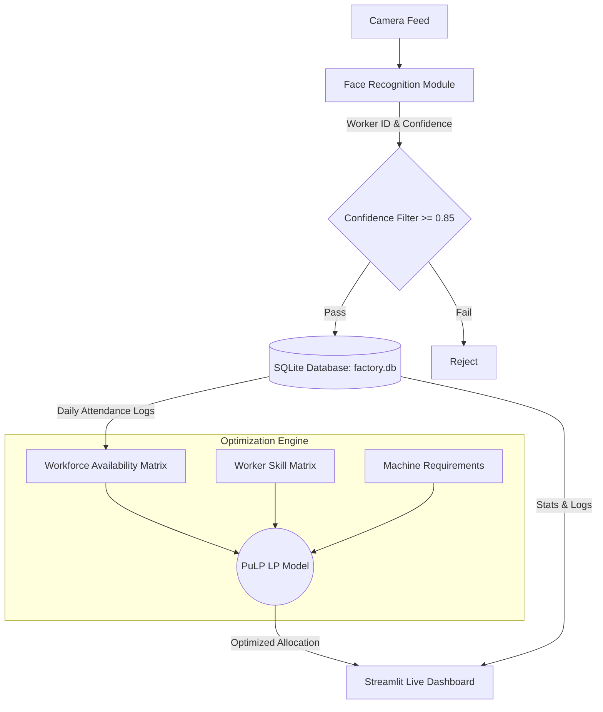

# Smart AI-Based Workforce Allocation and Predictive Maintenance System

## Architecture Diagram

The system connects real-time worker face recognition with a dynamic workforce allocation engine.



## Setup & Execution

### 1. Requirements
```bash
pip install pandas pulp streamlit
```

### 2. Initialization & Pipeline
You can simulate the camera pipeline continuously by running:
```bash
python main_system.py
```

### 3. Live Dashboard
Once the database `factory.db` is initialized, run the dashboard to view real-time smart allocations:
```bash
streamlit run dashboard.py
```
